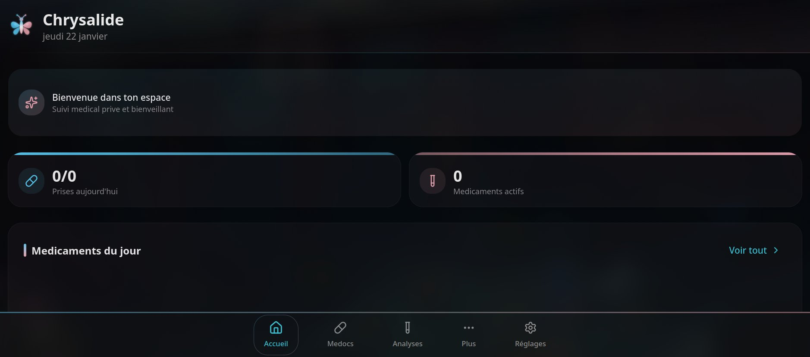

<div align="center">

# Chrysalide

[]()
[](LICENSE)
[]()

**Personal medical tracking for trans people**

_Local-first web app to manage HRT, blood tests, and physical progress_


</div>

---

## Features

- **HRT Tracking** — Medications, doses, daily intake, stock management
- **Blood Tests** — Hormone results with context-aware evolution charts
- **Reference Ranges** — Visualization of hormone targets (feminizing/masculinizing)
- **Physical Progress** — Secure photos, measurements, comparative timeline
- **Appointments** — Annual calendar, reminders, practitioner management
- **Practitioner Directory** — Contact info, autocomplete, history
- **Journal** — Mood tracking, side effects, custom tags
- **Objectives** — BLAHAJ visual progress, pre-configured templates (HRT, surgeries, legal documents)
- **100% Local** — Data stored only on your device
- **PWA** — Installable on mobile/desktop, works offline
- **Dark Mode** — Dark theme by default, trans flag colors

---

## Privacy

**Your medical data NEVER leaves your device.**

- 100% local storage (IndexedDB)
- No account required
- No server, no tracking
- Manual export/import for backups
- Open source and verifiable code

---

## Screenshot

<div align="center">



</div>

---

## Installation

Chrysalide is a **Progressive Web App (PWA)**: a web app that installs like a native app on your device, without going through an app store.

### Step 1: Open the app

👉 **[chrysalide.kushie.dev](https://chrysalide.kushie.dev)**

---

### Step 2: Install based on your device

<details>
<summary><strong>📱 iPhone / iPad (Safari)</strong></summary>

1. Open the link in **Safari** (not Chrome, not Firefox)
2. Tap the **Share** icon (square with upward arrow)
3. Scroll down and tap **"Add to Home Screen"**
4. Tap **"Add"**

The app appears on your home screen like a regular app.

</details>

<details>
<summary><strong>📱 Android (Chrome)</strong></summary>

1. Open the link in **Chrome**
2. Tap the menu **⋮** (three dots in top right)
3. Tap **"Install app"** or **"Add to Home screen"**
4. Confirm installation

The app appears in your app drawer.

</details>

<details>
<summary><strong>💻 Computer (Chrome / Edge)</strong></summary>

1. Open the link in **Chrome** or **Edge**
2. Click the install icon in the address bar (icon with + or screen)
3. Click **"Install"**

The app opens in its own window, like software.

</details>

<details>
<summary><strong>🦊 Firefox (Desktop)</strong></summary>

Firefox doesn't natively support PWA installation. You can:

- Use the app directly in browser (works great)
- Create a shortcut: Menu → More tools → Create shortcut

</details>

---

### What's a PWA?

A Progressive Web App combines the best of web and native apps:

- ✅ **No store** — Direct installation from browser
- ✅ **Offline** — Works without internet connection
- ✅ **Lightweight** — No heavy download
- ✅ **Auto-update** — Always latest version
- ✅ **Privacy** — Your data stays on your device

---

### Local Development

```bash
git clone https://github.com/kushiemoon-dev/chrysalide.git
cd chrysalide
pnpm install
pnpm run dev
```

Open http://localhost:3000

---

## Tech Stack

| Component  | Technology                  |
| ---------- | --------------------------- |
| Framework  | Next.js 16 (App Router)     |
| UI         | Tailwind CSS v4 + shadcn/ui |
| Database   | Dexie.js (IndexedDB)        |
| Charts     | Recharts                    |
| Icons      | Lucide React                |
| Dates      | date-fns                    |
| Validation | Zod + React Hook Form       |

---

## Structure

```
src/
├── app/
│   ├── page.tsx          # Dashboard
│   ├── medications/      # Medications module
│   ├── bloodtests/       # Blood tests
│   ├── progress/         # Physical progress
│   ├── appointments/     # Appointments + annual calendar
│   ├── practitioners/    # Practitioner directory
│   ├── journal/          # Personal journal
│   ├── objectives/       # Transition objectives
│   └── settings/         # Settings
├── components/
│   ├── brand/            # Logo, trans branding
│   ├── layout/           # Header, navigation
│   ├── appointments/     # Calendar, practitioner input
│   ├── objectives/       # BLAHAJ progress, cards
│   └── ui/               # shadcn components
└── lib/
    ├── db.ts             # Dexie configuration
    ├── types.ts          # TypeScript types
    └── constants.ts      # Constants + objective templates
```

---

## Design

"Soft & Cozy" theme with trans flag colors:

| Color | Hex       | Usage             |
| ----- | --------- | ----------------- |
| Blue  | `#5BCEFA` | Accents, links    |
| Pink  | `#F5A9B8` | Secondary accents |
| White | `#FFFFFF` | Text, contrasts   |

---

## License

MIT License — see [LICENSE](LICENSE)

---

<div align="center">

Made with love for the trans community

[Codeberg](https://codeberg.org/kushiemoon-dev/chrysalide) · [GitHub](https://github.com/kushiemoon-dev/chrysalide)

</div>
